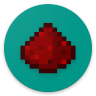

<h1 align="center">
   
  
   
  Redstone
   
</h1>

# Introduction

`Redstone` is an experimental Minecraft server built with C# and .NET 5.

The project has been created for learning purposes, about the network, game logic and Minecraft world generation problematics.

The goal is to provide a clean and simple API to develop highly performant Minecraft servers.

Redstone uses a [`HostBuilder`](https://docs.microsoft.com/en-us/dotnet/core/extensions/generic-host) to benefit the use of using modern design patterns such as [Dependency Injection](https://docs.microsoft.com/en-us/dotnet/core/extensions/dependency-injection), [Logging](https://docs.microsoft.com/en-us/dotnet/core/extensions/logging) and [Configuration](https://docs.microsoft.com/en-us/dotnet/core/extensions/configuration) loading.

<h4 align="center">:warning: This project is not affiliated with Mojang Studios. :warning:</h4>

## Getting started

Before getting started, you will need to install the following softwares in order to contrribute to the Redstone project:

* [Git SCM](https://git-scm.com/)
* Visual Studio 2019 (or [Visual Studio Code](https://code.visualstudio.com/))
* [Docker](https://www.docker.com/get-started)
  * *With `docker-compose`*

> The solution is configured to run with Linux containers.

One you have checked out the repository, you can open the `Redstone.sln` solution in visual studio, set the `docker-compose` project as "Startup Project" and start the debug to get a working server in debug mode.

Note: The configuration files of the project are located in the `bin/config` folder, located at the root directory of the project.
